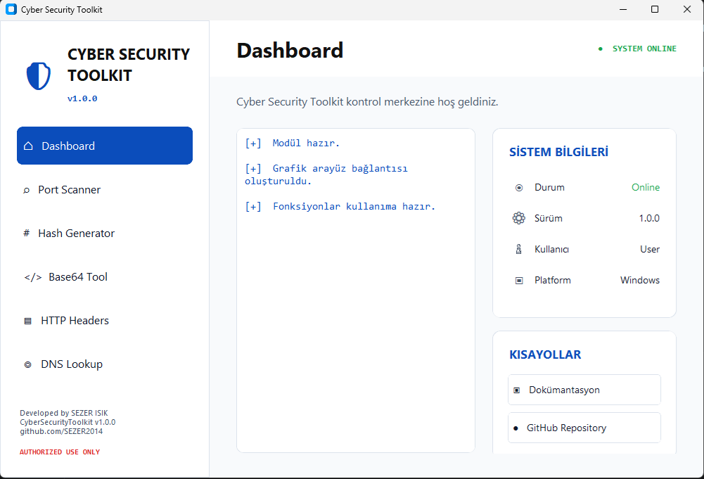

# Cyber Security Toolkit

[Türkçe](#türkçe) | [English](#english)

---

# Türkçe

Cyber Security Toolkit, Python ve CustomTkinter ile geliştirilmiş, Windows üzerinde çalışan modüler bir masaüstü siber güvenlik araç setidir.

Uygulama; temel güvenlik kontrollerini sade ve modern bir arayüz üzerinden gerçekleştirmek, öğrenme sürecini desteklemek ve kişisel projelerde kullanılmak amacıyla geliştirilmiştir.

## Ekran Görüntüsü



## Özellikler

- TCP Port Scanner
- Hash Generator
- Base64 Encoder / Decoder
- HTTP Header Analyzer
- DNS Lookup
- Modern açık tema
- Yasal ve etik kullanım uyarısı
- Sonuçları panoya kopyalama desteği
- GitHub ve dokümantasyon kısayolları

## Modüller

### TCP Port Scanner
Belirlenen TCP port aralığını tarar, açık portları tespit eder ve ilgili servis bilgilerini görüntüler.

### Hash Generator
Girilen metin için MD5, SHA-1, SHA-256 ve SHA-512 algoritmalarıyla hash değeri oluşturur.

### Base64 Tool
Metinleri Base64 formatına kodlar ve geçerli Base64 verilerini çözer.

### HTTP Header Analyzer
Bir web adresinin HTTP yanıt başlıklarını görüntüler ve temel güvenlik başlıklarını analiz eder.

### DNS Lookup
Alan adlarının IP adreslerini, hostname bilgilerini, alias kayıtlarını ve ters DNS sonuçlarını görüntüler.

## Kurulum

```powershell
git clone https://github.com/SEZER2014/CyberSecurityToolkit.git
cd CyberSecurityToolkit
py -m pip install -r requirements.txt
py gui.py
```

## Sistem Gereksinimleri

- Windows 10 veya Windows 11
- Python 3.10 veya üzeri
- İnternet bağlantısı gerektiren modüller için aktif ağ bağlantısı

## Yasal ve Etik Kullanım

Bu uygulama yalnızca eğitim, kişisel gelişim ve açıkça izin verilmiş sistemlerde güvenlik testi amacıyla kullanılmalıdır.

Uygulamanın kötü amaçlı veya yetkisiz sistemlerde kullanımından ya da doğabilecek sonuçlardan geliştirici sorumlu değildir.

## Geliştirici

**Developed by SEZER ISIK**

- CyberSecurityToolkit v1.0.0
- GitHub: [SEZER2014](https://github.com/SEZER2014)

## Lisans

Bu proje MIT License ile lisanslanmıştır. Ayrıntılar için [LICENSE](LICENSE) dosyasını inceleyebilirsiniz.

---

# English

Cyber Security Toolkit is a modular desktop cybersecurity toolkit developed with Python and CustomTkinter for Windows.

The application was created to perform basic security checks through a simple and modern interface, support the learning process, and provide a practical foundation for personal cybersecurity projects.

## Screenshot


## Features

- TCP Port Scanner
- Hash Generator
- Base64 Encoder / Decoder
- HTTP Header Analyzer
- DNS Lookup
- Modern light theme
- Legal and ethical use warning
- Copy results to clipboard
- GitHub and documentation shortcuts

## Modules

### TCP Port Scanner
Scans a selected TCP port range, detects open ports, and displays available service information.

### Hash Generator
Generates MD5, SHA-1, SHA-256, and SHA-512 hash values for input text.

### Base64 Tool
Encodes text into Base64 format and decodes valid Base64 data.

### HTTP Header Analyzer
Displays HTTP response headers and analyzes common security headers.

### DNS Lookup
Displays IP addresses, hostname information, aliases, and reverse DNS results for a domain.

## Installation

```powershell
git clone https://github.com/SEZER2014/CyberSecurityToolkit.git
cd CyberSecurityToolkit
py -m pip install -r requirements.txt
py gui.py
```

## System Requirements

- Windows 10 or Windows 11
- Python 3.10 or later
- An active network connection for modules that require internet access

## Legal and Ethical Use

This application must only be used for education, personal development, and security testing on systems for which explicit authorization has been granted.

The developer is not responsible for malicious or unauthorized use of the application or for any resulting consequences.

## Developer

**Developed by SEZER ISIK**

- CyberSecurityToolkit v1.0.0
- GitHub: [SEZER2014](https://github.com/SEZER2014)

## License

This project is licensed under the MIT License. See the [LICENSE](LICENSE) file for details.

## Usage

```bash
python3 main.py
```
